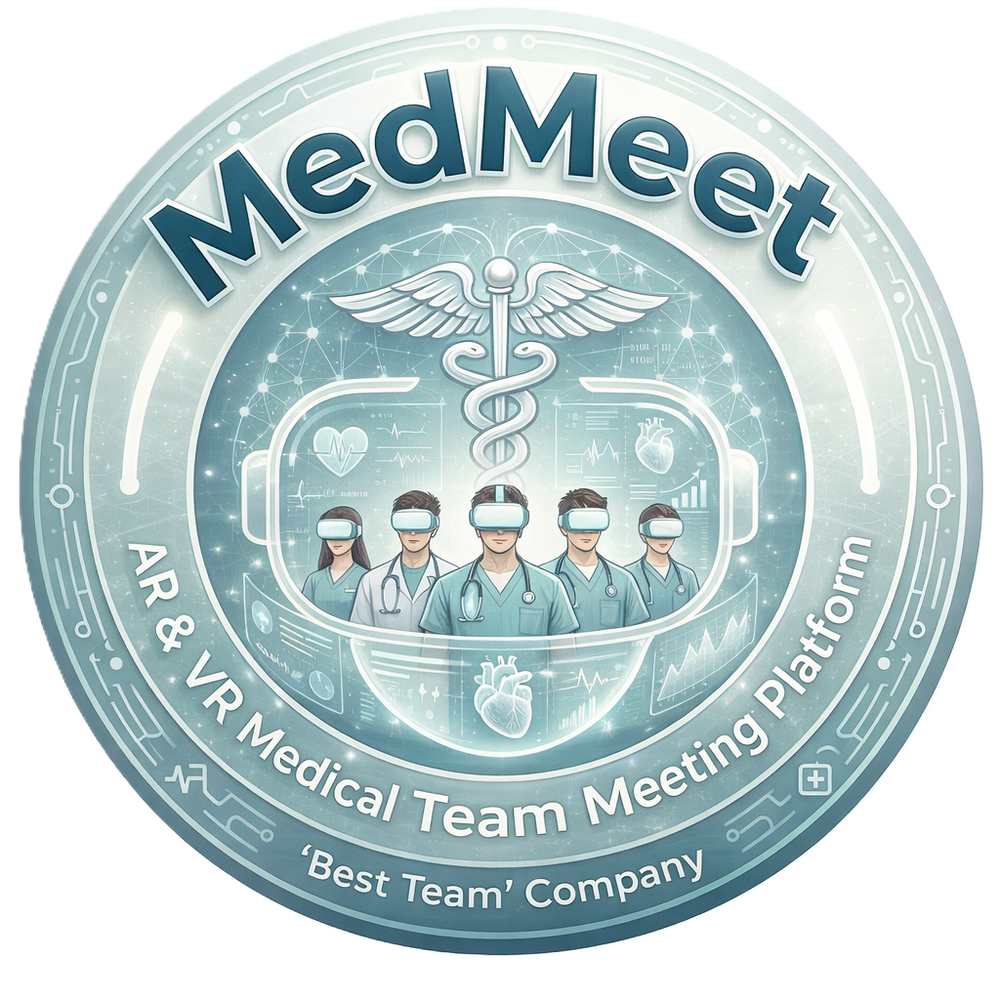

<div align="center">



# MedMeet - Project Site

**A multi-user VR/AR platform where doctors and patients meet inside a shared 3D
consultation room instead of a flat video call.**

### [🌐 Open the site](https://rotemswisa.github.io/MedMeet/)

<sub>Final year Software Engineering project · Kinneret Academic College · 2025 to 2026</sub>

</div>

---

## What this repository is

This repository holds the **project site**, published with GitHub Pages. It is the place
to go if you want to *see* MedMeet rather than read its code: demo videos from every
sprint, screenshots of each feature, the poster, and the full written documentation.

The Unity source code lives in a separate repository:
**[MedMeet-VR-AR](https://github.com/RotemSwisa/MedMeet-VR-AR)**.

## What is on the site

| Section | Contents |
|---|---|
| **Home** | What the platform does and the problem it addresses |
| **Team** | The four people who built it, and what each of us owned |
| **Gallery** | Screenshots of the consultation rooms, anatomy models, surgery simulations and AR mode |
| **Videos** | Demo recordings from each of the four sprints |
| **Presentations** | Sprint documentation and the final presentation |

## Repository layout

```
index.html          the site itself, a single page in Hebrew
images/
  logo.png          project logo
  gallery/          feature screenshots
  posters/          poster artwork
  *.png             team photos
presentations/
  MedMeet_Final.pdf         final presentation
  project_full_summary.pdf  full project summary
  s1_*.pdf                  sprint 1: backlog, test plan, architecture,
  s2_*.pdf                  user manual, retrospective, MVP presentation,
  s3_*.pdf                  summary
  s4_*                      final presentation and poster
  team_personal_summaries.pdf
```

Each sprint folder set follows the same seven-document pattern, so the documentation can
be read either sprint by sprint or document type by document type across the whole year.

## About the project

MedMeet was built in Unity for the Meta Quest 3 over four Agile sprints. Participants join
a room as avatars, talk with spatial voice, and work together on the same anatomical model,
with a real-time sign language avatar, AI transcription, surgery training rooms and an AR
passthrough mode.

For the full feature list, the architecture and the tech stack, see the
**[source repository](https://github.com/RotemSwisa/MedMeet-VR-AR)**.

## Team

Lidor Ben Simon · David Ran Cohen · Libar Vizman · Rotem Mery Swisa
